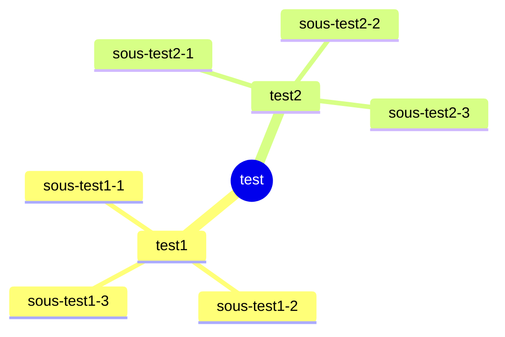

# victorgileau.github.io

```mermaid
mindmap
  root((test))
    test1
      sous-test1-1
      sous-test1-2
      sous-test1-3
    test2
      sous-test2-1
      sous-test2-2
      sous-test2-3
```
